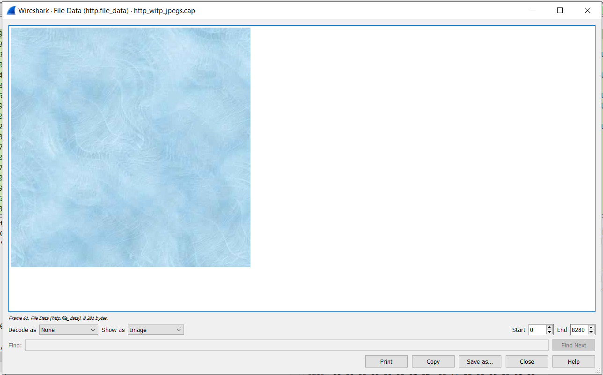
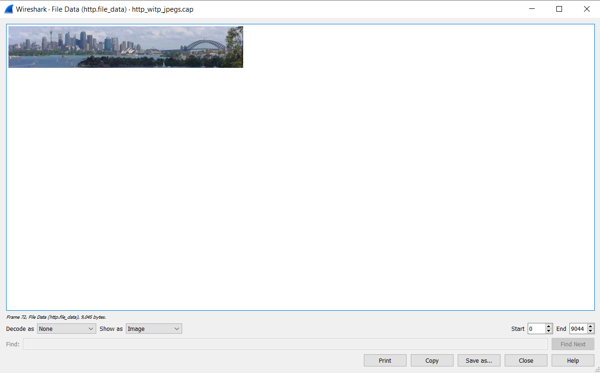
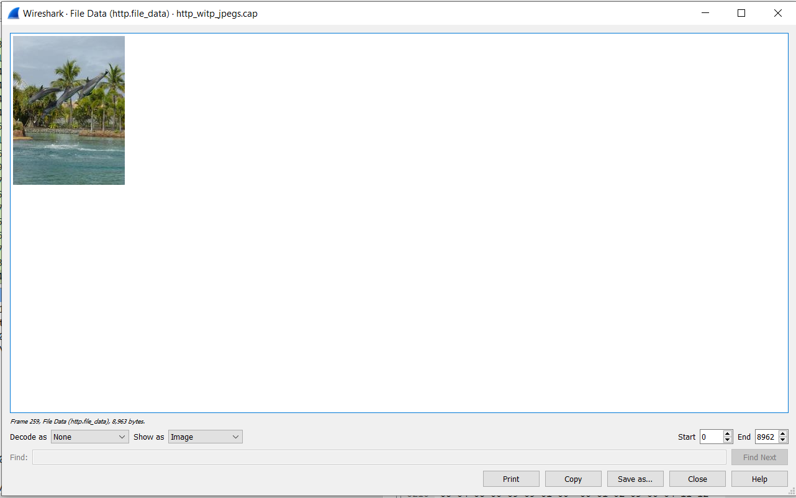
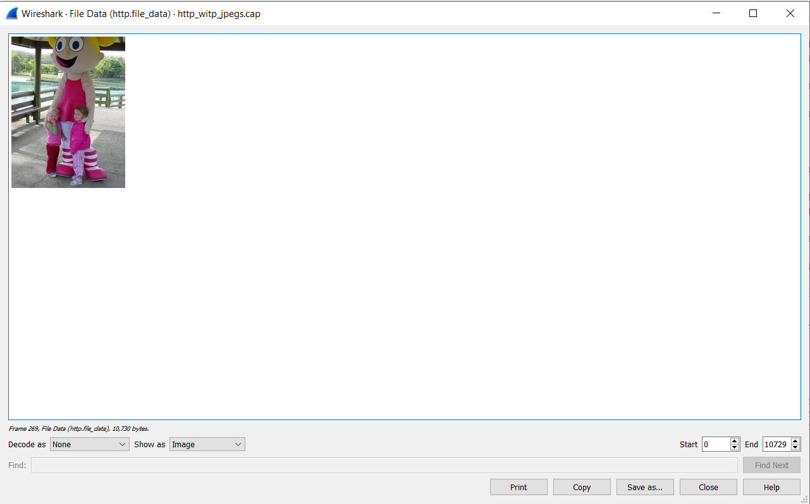
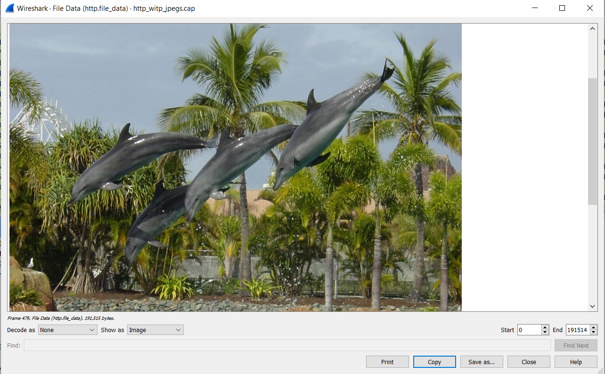

# Analisa HTTP WITP JPEG

Pada file http_witp_jpeg.cap Response yang menampilkan gambar terletak pada packet: 61,72,259,269,479

**Untuk Menampilkan gambar kita perlu:**

1. Buka File http_witp_jpeg.cap.
2. Lalu tekan CTRL+F kemudian pilih String yang sebelumnya Display Filter
3. Ketikkan 200 OK  (JPEG JFIF image) yang berarti bahwa 200 merupakan response sukses dari server dan (JPEG JFIF image) merupakan jenis file yang terkirim ke client
4. Lalu klik 1 kali package tersebut kemudian Buka Hypertext Transfer Protocol
5. Kemudian klik 1 kali dan cari File Data
6. Setelah itu klik kanan pada baris yang menunjukkan File Data dan pilih Show Packet Bytes

**Isi Packet 61:**

**Isi Packet 72:**

**Isi Packet 259:**

**Isi Packet 269:**

**Isi Packet 479:**

