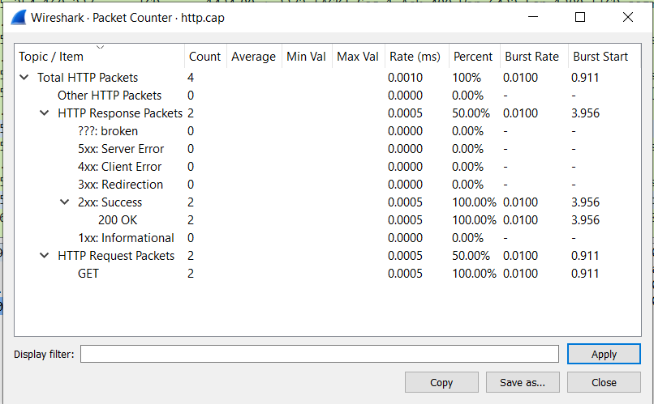

# HTTP Packet Counter

HTTP packets terletak pada packet:4,18,27,38

**Pada packet 4** merupakan packet yang melakukan request berupa GET/download.html HTTP/1.1 dan akan di response **Pada packet 38**. Packet ini bertujuan untuk mengakses http://www.ethereal.com/download.html

**Pada packet 18** merupakan packet yang melakukan request berupa GET http://pagead2.googlesyndication.com/pagead/ads?client=ca-pub-2309191948673629&random=1084443430285&lmt=1082467020&format=468x60_as&output=html&url=http%3A%2F%2Fwww.ethereal.com%2Fdownload.html&color_bg=FFFFF dan akan di response oleh server **Pada packet 27**. Packet ini bertujuan untuk mengakses http://pagead2.googlesyndication.com/pagead/ads?client=ca-pub-2309191948673629&random=1084443430285&lmt=1082467020&format=468x60_as&output=html&url=http%3A%2F%2Fwww.ethereal.com%2Fdownload.html&color_bg=FFFFF.

# Jenis-jenis respons HTTP:

1. **1xx (Informational)**: Respons ini adalah informasi yang hanya memberi tahu klien bahwa permintaannya telah diterima dan diproses sebagian. Kode status ini jarang digunakan secara umum.

2. **2xx (Success)**: Respons ini menunjukkan bahwa permintaan klien telah berhasil diterima, dipahami, dan direspon dengan baik oleh server. Beberapa kode status yang termasuk dalam kategori ini adalah:

   200 OK: Permintaan berhasil dan respons berisi data yang diminta.

   201 Created: Permintaan berhasil, dan server telah membuat sumber daya baru.

   204 No Content: Permintaan berhasil, tetapi respons tidak mengandung konten. Biasanya digunakan untuk operasi tanpa respons.

3. **3xx (Redirection)**: Respons ini menunjukkan bahwa klien harus mengambil tindakan tambahan untuk menyelesaikan permintaannya. Beberapa kode status yang termasuk dalam kategori ini adalah:

   301 Moved Permanently: Sumber daya yang diminta telah pindah secara permanen ke lokasi baru.

   302 Found / 307 Temporary Redirect: Sumber daya yang diminta sementara berada di lokasi lain.

   304 Not Modified: Sumber daya tidak berubah sejak permintaan sebelumnya, sehingga klien dapat menggunakan data yang disimpan secara lokal.

4. **4xx (Client Error)**: Respons ini menunjukkan bahwa terjadi kesalahan pada permintaan klien. Beberapa kode status yang termasuk dalam kategori ini adalah:

   400 Bad Request: Permintaan klien tidak dapat dipahami oleh server karena format yang salah atau parameter yang tidak valid.

   401 Unauthorized: Klien tidak diizinkan mengakses sumber daya tanpa autentikasi.

   404 Not Found: Sumber daya yang diminta tidak ditemukan di server.

5. **5xx (Server Error)**: Respons ini menunjukkan bahwa terjadi kesalahan pada server saat mencoba memproses permintaan. Beberapa kode status yang termasuk dalam kategori ini adalah:

   500 Internal Server Error: Terjadi kesalahan pada server yang tidak dapat ditentukan dengan jelas.

   503 Service Unavailable: Server tidak dapat menangani permintaan saat ini karena alasan tertentu.

Seiring dengan respons HTTP, ada juga permintaan HTTP yang dikirim oleh klien ke server. Salah satu permintaan paling umum adalah:

GET: Permintaan untuk mengambil informasi atau data dari server. Digunakan untuk mengambil halaman web atau sumber daya lain.

Selain GET, ada juga jenis permintaan lainnya seperti:

POST: Permintaan untuk mengirimkan data kepada server, yang biasanya digunakan untuk mengirim data yang akan diolah (misalnya, saat mengisi formulir).

PUT: Permintaan untuk mengirimkan data kepada server dan menggantikan sumber daya yang ada jika ada.

DELETE: Permintaan untuk menghapus sumber daya dari server.

PATCH: Permintaan untuk memperbarui sebagian data sumber daya di server.
