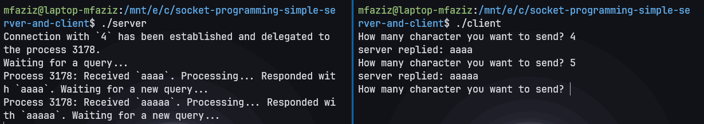
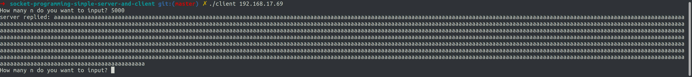
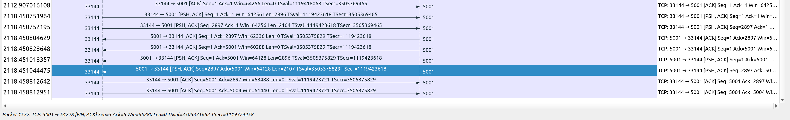

# Socket Programming

### Server_single.c:

1. **Pendahuluan**:
   - Program ini adalah contoh server sederhana yang menggunakan pendekatan single-threaded untuk melayani koneksi klien.
   
2. **Header Files**:
   - Kode ini menggunakan beberapa header files standar dalam bahasa C seperti `<stdio.h>`, `<stdlib.h>`, `<netdb.h>`, `<netinet/in.h>`, dan `<string.h>`.
   - Header files ini menyediakan definisi dan fungsi yang diperlukan untuk operasi input/output, manipulasi string, dan berinteraksi dengan jaringan.
     ```c
     #include <stdio.h>
     #include <stdlib.h>

     #include <netdb.h>
     #include <netinet/in.h>

     #include <string.h>
     ```

3. **Inisialisasi**:
   - Server ini menginisialisasi struktur `sockaddr_in` yang merepresentasikan alamat dan port tempat server akan mendengarkan.
   - Menetapkan nomor port dan alamat IP dengan `INADDR_ANY` (artinya akan mendengarkan semua antarmuka yang tersedia).
     ```c
      struct sockaddr_in serv_addr, cli_addr;
      portno = 5001;
      serv_addr.sin_family = AF_INET;
      serv_addr.sin_addr.s_addr = INADDR_ANY;
      serv_addr.sin_port = htons(portno);
     

4. **Socket Creation**:
   - Server membuat soket dengan memanggil `socket(AF_INET, SOCK_STREAM, 0)`. Ini menciptakan soket menggunakan protokol IPv4 dan jenis soket TCP (SOCK_STREAM).
     ```c
     sockfd = socket(AF_INET, SOCK_STREAM, 0);
     ```

5. **Binding**:
   - Server mengikat soket ke alamat yang telah diinisialisasi sebelumnya menggunakan `bind`.
   - Jika binding gagal, server mencetak pesan kesalahan dan keluar.
     ```c
       if (bind(sockfd, (struct sockaddr *)&serv_addr, sizeof(serv_addr)) < 0){
        perror("ERROR on binding\n");
        exit(1);
     }
      ```
6. **Listening**:
   - Server memulai mendengarkan koneksi dari klien menggunakan `listen`. Dalam contoh ini, server dapat menangani hingga 5 koneksi secara bersamaan.
     ```c
      listen(sockfd, 5);
     ```

7. **Menerima Koneksi**:
   - Ketika klien terhubung, server memanggil `accept` untuk menerima koneksi.
   - Ini menghasilkan soket baru (`newsockfd`) yang akan digunakan untuk berkomunikasi dengan klien.
     ```c
       newsockfd = accept(sockfd, (struct sockaddr *)&cli_addr, &clilen);
     ```

8. **Komunikasi dengan Klien**:
   - Server membaca pesan dari klien menggunakan `read` dan meresponsnya dengan mengirim pesan yang sama menggunakan `write`.
     ```c
      n = read(newsockfd, buffer, 255);
      n = write(newsockfd, buffer, strlen(buffer));
     ```
   - Jika pesan dari klien adalah "quit", server keluar dari loop dan program berakhir.
     ```c
      if (!bcmp(buffer, "quit", 4))
            break;
     ```
     

### Server.c:

1. **Pendahuluan**:
   - Program ini adalah contoh server yang lebih kompleks yang menggunakan pendekatan multi-threaded untuk melayani beberapa koneksi klien secara bersamaan.

2. **Fungsi Tambahan**:
   - Program ini mendefinisikan beberapa fungsi tambahan seperti `bzero`, `bcopy`, `init_sockaddr_in`, dan `process_operation`.
   - `bzero` dan `bcopy` digunakan untuk menginisialisasi dan menyalin memori. Meskipun sekarang jarang digunakan, mereka adalah bagian dari versi lama dari pustaka C.
   - `init_sockaddr_in` menginisialisasi dan mengembalikan struktur `sockaddr_in`.
   - `process_operation` adalah contoh fungsi pengolahan data yang sederhana.
     ```c
     void bzero(void *a, size_t n) {
       memset(a, 0, n);
      }
      
      void bcopy(const void *src, void *dest, size_t n) {
          memmove(dest, src, n);
      }
      
      struct sockaddr_in* init_sockaddr_in(uint16_t port_number) {
          struct sockaddr_in *socket_address = malloc(sizeof(struct sockaddr_in));
          memset(socket_address, 0, sizeof(*socket_address));
          socket_address -> sin_family = AF_INET;
          socket_address -> sin_addr.s_addr = htonl(INADDR_ANY);
          socket_address -> sin_port = htons(port_number);
          return socket_address;
      }
      
      char* process_operation(char *input) {
          size_t n = strlen(input) * sizeof(char);
          char *output = malloc(n);
          memcpy(output, input, n);
          return output;
      ```

4. **Inisialisasi dan Binding**:
   - Server melakukan inisialisasi dan binding serupa dengan `Server_single.c`.
     ```c
       const uint16_t port_number = 5001;
       int server_fd = socket(AF_INET, SOCK_STREAM, 0);
   
       struct sockaddr_in *server_sockaddr = init_sockaddr_in(port_number);
       struct sockaddr_in *client_sockaddr = malloc(sizeof(struct sockaddr_in));
       socklen_t server_socklen = sizeof(*server_sockaddr);
       socklen_t client_socklen = sizeof(*client_sockaddr);
   
   
       if (bind(server_fd, (const struct sockaddr *) server_sockaddr, server_socklen) < 0)
       {
           printf("Error! Bind has failed\n");
           exit(0);
       }
      ```

5. **Mengelola Koneksi**:
   - Server menciptakan proses anak untuk menangani setiap koneksi klien dengan memanggil `fork`. Setiap proses anak memiliki soketnya sendiri untuk berkomunikasi dengan klien.
     ```c
      pid = fork();
     ```

6. **Timeout**:
   - Server memiliki mekanisme timeout yang memungkinkan server menutup koneksi jika tidak ada aktivitas dari klien selama beberapa waktu.
     ```c
      if (strlen(buffer) == 0) {
                    clock_t d = clock() - last_operation;
                    double dif = 1.0 * d / CLOCKS_PER_SEC;

                    if (dif > 5.0) {
                        printf("Process %d: ", getpid());
                        close(client_fd);
                        printf("Connection timed out after %.3lf seconds. ", dif);
                        printf("Closing session with `%d`. Bye!\n", client_fd);
                        break;
                    }

                    continue;
                }
      ```

7. **Mengelola Klien**:
   - Dalam setiap proses anak, server membaca pesan dari klien, memprosesnya, dan mengirimkan respons.

### Client.c:

1. **Pendahuluan**:
   - Program ini adalah contoh klien yang berkomunikasi dengan server yang dijalankan di host lokal pada port tertentu.

2. **Inisialisasi dan Koneksi**:
   - Klien menciptakan soket dan menggunakan `gethostbyname` untuk mendapatkan informasi host server.
      ```c
       sockfd = socket(AF_INET, SOCK_STREAM, 0);
       server = gethostbyname("127.0.0.1");
      ```
   - Selanjutnya, klien terhubung ke server menggunakan `connect`.
     ```c
      if (connect(sockfd, (struct sockaddr *)&serv_addr, sizeof(serv_addr)) < 0) {
        perror("ERROR while connecting");
        exit(1);
       }
     ```
   

3. **Komunikasi dengan Server**:
   - Klien memasukkan pesan yang ingin dikirimkan ke server melalui `scanf`.
     ```c
      printf("What do you want to say? ");
        bzero(buffer,256);
        scanf("%s", buffer);
     ```
   - Pesan dikirim menggunakan `write`.
     ```c
     n = write(sockfd,buffer,strlen(buffer));
     ```
   - Klien kemudian membaca respons dari server menggunakan `read` dan mencetaknya.
     ```c
      n = read(sockfd, buffer, 255);
     ```

4. **Pesan "quit"**:
   - Klien dapat keluar dari loop dengan memasukkan pesan "quit".
     ```c
     if (!bcmp(buffer, "quit", 4))
            break;
     ```

### Hubungan dengan Socket Programming:

Kode-kode ini memanfaatkan fungsi-fungsi dasar dari pustaka socket. Mereka menciptakan, mengikat, mendengarkan, dan menerima koneksi pada sisi server. Pada sisi klien, mereka menciptakan soket, menghubungkan ke server, dan melakukan operasi baca/tulis untuk berkomunikasi. Dengan cara ini, mereka membentuk dasar dari komunikasi jaringan menggunakan protokol TCP/IP melalui socket. Masing-masing contoh menunjukkan berbagai aspek socket programming, dari penanganan koneksi tunggal hingga multi-threading untuk mendukung banyak koneksi secara bersamaan.

### Full close atau Half close

Kaitannya dengan half close atau full close, tidak ada implementasi half-close di dalam program-program ini. Half-close adalah teknik di mana salah satu ujung (client atau server) menutup koneksi hanya untuk mengirim data, tetapi tetap bisa menerima data. Ini berguna dalam situasi di mana satu pihak ingin menghentikan pengiriman data tetapi masih ingin menerima data yang dikirim oleh pihak lain.

Untuk implementasi half-close, Anda perlu mengatur kepala koneksi (connection header) atau pesan khusus antara client dan server untuk mengidentifikasi bahwa satu pihak ingin melakukan half-close. Kemudian, Anda harus mengatur kode untuk memproses kondisi ini dan memungkinkan satu pihak untuk menerima data sementara yang lain hanya mengirim data. Itu adalah implementasi yang lebih canggih yang mungkin memerlukan perubahan yang signifikan pada kode di atas.


## Percobaan

Dalam percobaan ini saya mencoba untuk mengirim pesan string 'a' dengan panjang 4 dan 5. Pesan tersebut diterima server lalu dikirimkan lagi ke client dengan sukses.



## Weireshark Analisis

Diabawah ini adalah perncoba mengirim pesan sebanyak 5000 karakter dari client ke server.





Satu request dalam dua segmen TCP terjadi karena data yang ingin dikirimkan oleh pengirim (host sumber) melebihi ukuran maksimum yang dapat diakomodasi dalam satu segmen TCP atau Maximum Segment Size (MSS). Segmen TCP adalah unit data dalam protokol TCP, dan ukurannya terbatas oleh beberapa faktor, termasuk Maximum Segment Size yang ditentukan selama penegosiasian koneksi TCP dan ukuran jendela (window size) yang tersedia di kedua ujung koneksi.

Berikut adalah beberapa alasan mengapa request dapat dibagi menjadi dua segmen TCP:

1. **MSS Terbatas:** Maximum Segment Size (MSS) adalah ukuran maksimum data yang dapat dikirim dalam satu segmen TCP. Nilai MSS ini dapat bervariasi tergantung pada implementasi dan konfigurasi TCP. Jika ukuran data yang ingin dikirim melebihi nilai MSS, maka data harus dibagi menjadi beberapa segmen yang lebih kecil.
   
2. **Penggunaan PSH:** PSH (Push) adalah salah satu flag dalam header TCP yang mengindikasikan bahwa data perlu segera disampaikan ke aplikasi penerima. Jika aplikasi pengirim menetapkan flag PSH, maka segmen akan dikirim secepat mungkin. Ini bisa menyebabkan pengiriman lebih cepat dari segmen pertama yang berisi data yang telah di-push, dan segmen kedua untuk data tambahan.
   
3. **Optimasi dan Pengiriman Efisien:** Terkadang, pembagian data menjadi segmen yang lebih kecil dapat memungkinkan pengiriman yang lebih efisien. Segmen yang lebih kecil dapat meminimalkan overhead dalam jaringan dan memungkinkan pengiriman data secepat mungkin jika ada kebutuhan mendesak untuk menerima data oleh penerima.
   
4. **Ukuran Jendela (Window Size):** Ukuran jendela (window size) TCP diatur oleh kedua ujung koneksi. Jika ukuran jendela kecil, maka penerima akan memberi tahu pengirim untuk mengurangi laju pengiriman data. Dalam situasi ini, pengirim dapat membagi data menjadi segmen yang lebih kecil agar sesuai dengan ukuran jendela yang tersedia.

Dalam kasus ini, request TCP dibagi menjadi dua segmen karena beberapa faktor di atas yang mengharuskan pembagian data menjadi lebih kecil agar sesuai dengan batasan-batasan yang ada dalam protokol TCP dan konfigurasi jaringan.
