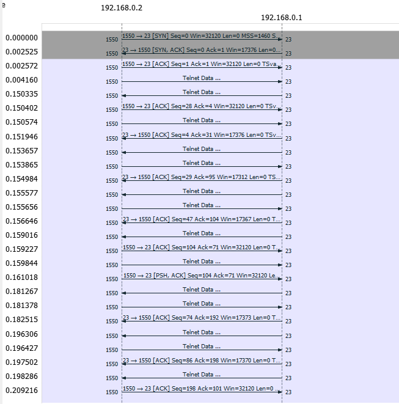
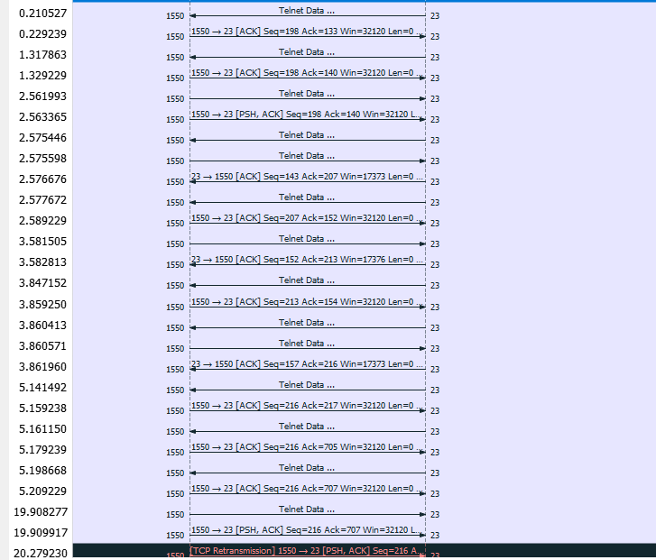
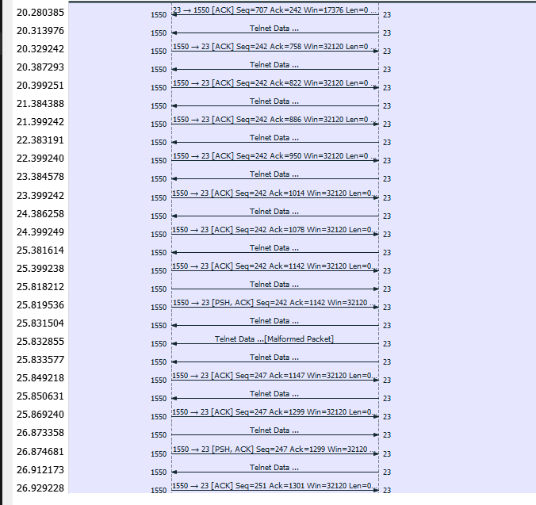
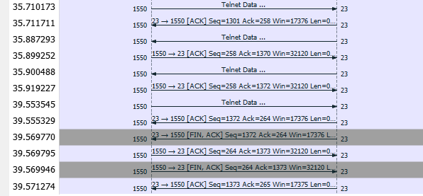

# Telnet 
Telnet adalah sebuah protokol jaringan yang digunakan untuk mengakses dan mengendalikan perangkat jarak jauh melalui jaringan, seperti mengakses server atau perangkat yang menjalankan layanan jarak jauh. Telnet memungkinkan pengguna untuk berinteraksi dengan perangkat atau sistem yang berjalan di jaringan, seolah-olah mereka berada di lokasi fisik yang sama dengan perangkat tersebut. Ini adalah salah satu protokol yang awalnya digunakan secara luas untuk akses remote sebelum keamanan menjadi perhatian utama.

Spesifikasi Telnet terdokumentasi dalam RFC 854. RFC 854 adalah dokumen standar Internet yang mendefinisikan protokol Telnet dan menjelaskan karakteristik utamanya. Berikut adalah beberapa karakteristik kunci dari Telnet (dalam konteks TCP):

1. Protokol Teks: Telnet adalah protokol berbasis teks, yang berarti data yang ditransmisikan antara client dan server adalah teks mentah yang dapat dibaca manusia. Ini memungkinkan pengguna untuk berinteraksi dengan perangkat jarak jauh menggunakan perintah dan respon teks.

2. Port Default: Port standar untuk Telnet adalah 23.

3. Clear Text: Salah satu karakteristik yang penting untuk dicatat adalah bahwa Telnet mengirim data dalam bentuk teks biasa (clear text) tanpa enkripsi. Oleh karena itu, data yang dikirim melalui Telnet tidak aman jika melintasi jaringan yang tidak aman. Ini adalah alasan mengapa penggunaan Telnet telah berkurang dan sering digantikan oleh protokol lain seperti SSH (Secure Shell) yang menawarkan keamanan lebih baik melalui enkripsi.

4. Tersedia di Banyak Sistem Operasi: Klien dan server Telnet tersedia di berbagai sistem operasi, sehingga memungkinkan pengguna dari berbagai platform untuk terhubung dan berinteraksi dengan perangkat atau sistem yang menjalankan layanan Telnet.

5. Berbasis TCP: Telnet berjalan di atas protokol transport TCP (Transmission Control Protocol) untuk memastikan pengiriman data yang andal.

6. Akses Jarak Jauh: Telnet digunakan untuk mengakses perangkat atau sistem dari jarak jauh melalui jaringan. Ini berarti pengguna dapat mengendalikan dan berinteraksi dengan perangkat atau sistem yang berada di lokasi geografis yang berbeda.

7. Kurang Aman: Salah satu kekurangan utama Telnet adalah kurangnya keamanan bawaan. Karena data yang dikirim melalui Telnet tidak dienkripsi, informasi sensitif seperti kata sandi dapat dengan mudah dicuri jika data ini disadap selama transmisi. Itu sebabnya penggunaan Telnet di jaringan yang tidak aman sangat tidak disarankan.

Karena kelemahan keamanannya, Telnet telah digantikan oleh protokol SSH yang menawarkan enkripsi dan tingkat keamanan yang lebih tinggi. Oleh karena itu, dalam banyak kasus, Telnet tidak lagi digunakan dalam lingkungan produksi yang mengharuskan tingkat keamanan yang lebih tinggi.

## TCP Flow Graph Telnet (telnet-cooked.cap)

## Penjelasan:
Istilah "Telnet data" mengacu pada payload atau isi dari paket-paket Telnet yang terdapat dalam berkas PCAP (Packet Capture) yang berupa teks.Payload atau isi paket-paket Telnet ini mungkin berisi perintah, perintah yang dikirim oleh pengguna dari client ke server, atau respon, respon yang dikirim oleh server ke client. Contoh data yang mungkin ada dalam payload paket Telnet termasuk:

1. Perintah dan Argumen: Jika pengguna di client memasukkan perintah (misalnya, perintah untuk menjalankan program atau mengakses berkas), perintah ini akan disertakan dalam payload.

2. Respon Server: Server Telnet akan mengirimkan respon ke client sebagai hasil dari perintah yang diterima. Respon ini akan berisi teks yang akan ditampilkan kepada pengguna.

3. Pesan Sistem: Telnet juga dapat digunakan untuk mengirim pesan sistem atau informasi yang berguna kepada pengguna atau administrator. Pesan-pesan ini juga dapat ada dalam payload.

Penting untuk dicatat bahwa karena Telnet adalah protokol berbasis teks dan data dikirim dalam bentuk teks yang jelas (clear text), maka payload Telnet dapat dengan mudah dibaca jika data tersebut tidak dienkripsi. Ini berarti jika ada data sensitif yang dikirimkan melalui Telnet, maka data tersebut dapat dengan mudah disadap jika ada pihak yang memiliki akses ke paket-paket Telnet yang berlalu-lintas di jaringan.

Ketika menganalisis berkas telnet-cooked.pcap, Anda dapat menggunakan alat seperti Wireshark atau tcpdump untuk melihat isi payload dari paket-paket Telnet. Hal ini dapat membantu Anda memahami perintah, respon, atau informasi apa yang dikirimkan antara client dan server Telnet selama sesi komunikasi.

# SSH
**SSH (Secure Shell)** adalah protokol jaringan yang digunakan untuk mengamankan komunikasi dan mengakses perangkat jarak jauh atau server melalui jaringan. SSH dirancang untuk menggantikan protokol Telnet yang kurang aman. Berikut adalah penjelasan lebih lanjut tentang SSH:

**RFC**: SSH pertama kali didefinisikan dalam RFC 4251 hingga RFC 4256. Beberapa RFC lainnya yang terkait dengan SSH mencakup RFC 4250 hingga RFC 4254.

**Karakteristik Utama SSH**:

1. **Keamanan**: Salah satu karakteristik utama SSH adalah keamanan. Semua data yang ditransmisikan antara client dan server SSH dienkripsi, sehingga melindungi kerahasiaan dan integritas data. Ini membuatnya aman digunakan bahkan di jaringan yang tidak aman.

2. **Autentikasi**: SSH menyediakan berbagai metode autentikasi, termasuk menggunakan kata sandi, kunci publik/privat, serta otentikasi berbasis token. Ini memungkinkan penggunaan metode otentikasi yang lebih kuat dan lebih aman.

3. **Koneksi Aman**: SSH menjaga koneksi yang aman sepanjang sesi, dan jika ada upaya gangguan atau pemutusan koneksi, koneksi akan ditutup secara aman.

4. **Port Standar**: Port standar untuk SSH adalah 22, meskipun ini dapat diubah sesuai kebutuhan. Hal ini berbeda dengan Telnet yang menggunakan port standar 23.

5. **Protokol Teks dan Grafis**: SSH mendukung transfer data teks yang jelas seperti Telnet, tetapi juga mendukung transfer data grafis melalui X forwarding, yang memungkinkan aplikasi grafis dijalankan di server jarak jauh dan ditampilkan di client.

6. **Manajemen Kunci**: SSH memungkinkan pengguna untuk mengelola kunci publik/privat untuk otentikasi yang lebih aman. Ini memungkinkan penggunaan otentikasi tanpa kata sandi.

**Perbedaan dengan Telnet**:

1. **Keamanan**: Perbedaan terbesar antara SSH dan Telnet adalah keamanan. SSH mengenkripsi seluruh sesi komunikasi, sementara Telnet mengirimkan data dalam bentuk teks jelas (clear text) tanpa enkripsi. Ini membuat Telnet rentan terhadap penyadapan data.

2. **Autentikasi**: SSH memiliki berbagai metode autentikasi yang kuat, termasuk kunci publik/privat, sementara Telnet lebih terbatas dalam hal ini dan umumnya menggunakan kata sandi untuk otentikasi.

3. **Port**: Port standar untuk SSH adalah 22, sedangkan Telnet menggunakan port standar 23. Ini membuat SSH lebih mudah diidentifikasi dan dipisahkan dari lalu lintas jaringan biasa.

4. **Manajemen Kunci**: SSH memungkinkan manajemen kunci publik/privat yang kuat, sedangkan Telnet tidak memiliki fitur ini.

5. **Integritas Data**: SSH memastikan integritas data dengan mengenkripsi dan menambahkan checksum pada data yang ditransmisikan. Telnet tidak memiliki mekanisme ini.

Kesimpulannya, SSH adalah protokol jaringan yang lebih aman, lebih kuat, dan lebih modern dibandingkan Telnet. Ini adalah pilihan yang lebih baik untuk mengakses dan mengelola perangkat atau server jarak jauh dalam lingkungan yang memperhatikan keamanan.
