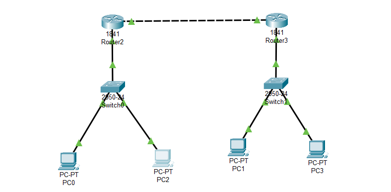

**Router:** Setiap router memiliki dua antarmuka yang menghubungkan jaringan yang berbeda. Sebagai contoh, kita akan menggunakan dua jaringan berbeda: Jaringan A dan Jaringan B. Konfigurasi antarmuka router mungkin terlihat seperti ini:

Router 1:
  - Antarmuka 0/0:
    - IP Address: 192.168.1.1
    - Subnet Mask: 255.255.255.0
  - Antarmuka 0/1:
    - IP Address: 10.0.1.1
    - Subnet Mask: 255.255.255.0

Router 2:
  - Antarmuka 0/0:
    - IP Address: 192.168.2.1
    - Subnet Mask: 255.255.255.0
  - Antarmuka 0/1:
    - IP Address: 10.0.1.2
    - Subnet Mask: 255.255.255.0

**Switch:** Setiap switch menghubungkan dua PC dalam jaringan yang sama. Misalnya:

Switch 1:
  - PC1:
    - IP Address: 192.168.1.10
    - Subnet Mask: 255.255.255.0
  - PC2:
    - IP Address: 192.168.1.20
    - Subnet Mask: 255.255.255.0

Switch 2:
  - PC3:
    - IP Address: 192.168.2.10
    - Subnet Mask: 255.255.255.0
  - PC4:
    - IP Address: 192.168.2.20
    - Subnet Mask: 255.255.255.0
