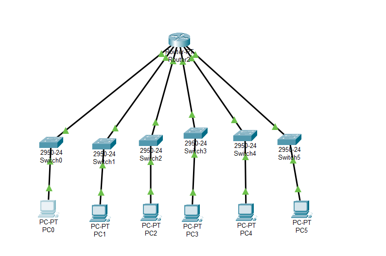

# Cisco 6 Subnet 1 Router 6 Pc

**Configurasi:**

Router 1:

- FastEthernet 0/0:
  - IP Address: 12.32.0.1
  - Subnet Mask: 255.224.0.0
- FastEthernet 1/0:
  - IP Address: 12.64.0.1
  - Subnet Mask: 255.224.0.0
- FastEthernet 2/0:
  - IP Address: 12.96.0.1
  - Subnet Mask: 255.224.0.0
- FastEthernet 3/0:
  - IP Address: 12.128.0.1
  - Subnet Mask: 255.224.0.0
- FastEthernet 4/0:
  - IP Address: 12.160.0.1
  - Subnet Mask: 255.224.0.0
- FastEthernet 5/0:
  - IP Address: 12.192.0.1
  - Subnet Mask: 255.224.0.0

PC 1:

- IP Address: 12.32.0.2
- Subnet Mask: 255.224.0.0
- Gateway: 12.32.0.1

PC 2:

- IP Address: 12.64.0.2
- Subnet Mask: 255.224.0.0
- Gateway: 12.64.0.1

PC 3:

- IP Address: 12.96.0.2
- Subnet Mask: 255.224.0.0
- Gateway: 12.96.0.1

PC 4:

- IP Address: 12.128.0.2
- Subnet Mask: 255.224.0.0
- Gateway: 12.128.0.1

PC 5:

- IP Address: 12.160.0.2
- Subnet Mask: 255.224.0.0
- Gateway: 12.160.0.1

PC 6:

- IP Address: 12.192.0.2
- Subnet Mask: 255.224.0.0
- Gateway: 12.192.0.1
