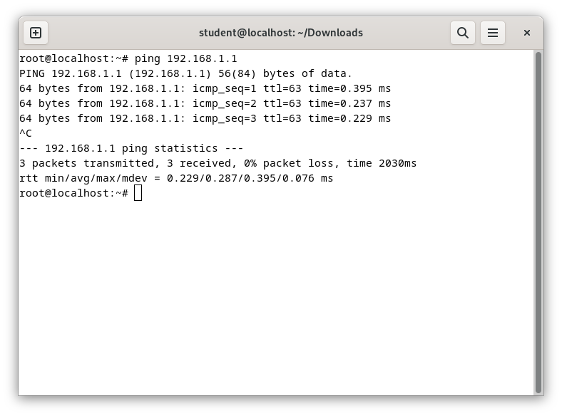

# Physical Router

Pada laporan ini, kita melakukan praktikum secara langsung menggunakan bentuk fisik dari router dan melakukan configurasi langsung ke router dimana router
tersebut juga berfungsi sebagai switch yang menghubungkan router ke pc lab dimana kelompok kita mendapat IP antar router yaitu 10.252.108.13/24 dan network ke pc 192.168.3.0/24.

## Configurasi pada mikrotik

### 1. Koneksi

### 2. Tambah Bridge & Port (ether 2-9)

### 3. Tambah dan config address

.png)

.png)

### 4. Tambah Route

6. Uji Ping (Antar PC dengan IP 192.168.3.2 dalam 1 Router)

Ping ke PC dengan IP 192.168.3.3

Ping ke PC dengan IP 192.168.3.4

Ping ke Router dengan Gateway 192.168.3.1

7. Uji Ping (Ping ke router lain dalam 10.252.108.0/24)

