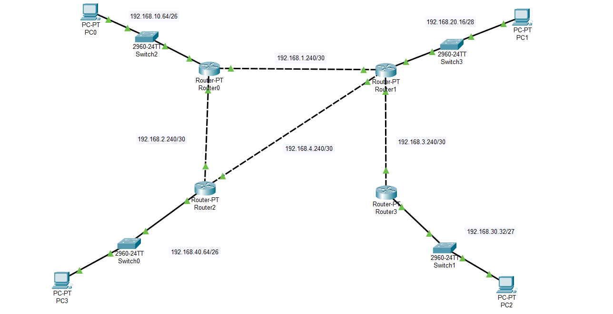
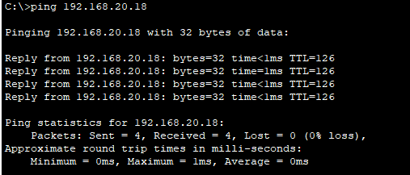
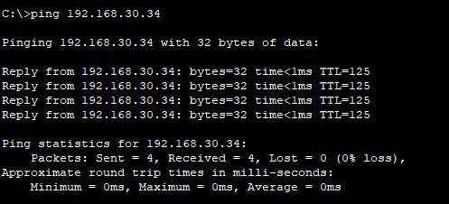
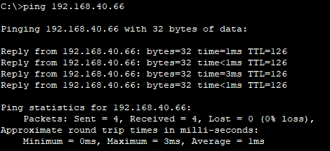
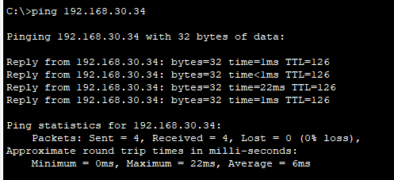
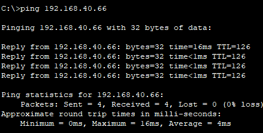
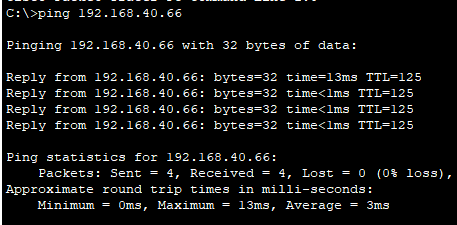

# Cisco 4 Router

## Configurasi
**Router 0:**

FastEthernet Antar Router:

    FastEthernet 0/0: 192.168.1.241
    FastEthernet 1/0: 192.168.2.241
  
FastEthernet Ke PC:

    FastEthernet 6/0: 192.168.10.65 (Karena 64 merupakan Networknya)
Static Route:

    192.168.20.16/28 via 192.168.1.242
    192.168.40.64/26 via 192.168.2.242
    192.168.30.32/27 via 192.168.1.242
    
**Router 1:**

FastEthernet Antar Router:

    FastEthernet 0/0: 192.168.1.242
    FastEthernet 1/0: 192.168.3.241
    FastEthernet 6/0: 192.168.4.242
  
FastEthernet Ke PC:

    FastEthernet 6/0: 192.168.20.17 (Karena 16 merupakan Networknya)

Static Route:

    192.168.10.64/26 via 192.168.1.241
    192.168.40.64/26 via 192.168.4.241
    192.168.30.32/27 via 192.168.3.242

    
**Router 2:**

FastEthernet Antar Router:

    FastEthernet 0/0: 192.168.2.242
    FastEthernet 1/0: 192.168.4.241
  
FastEthernet Ke PC:

    FastEthernet 6/0: 192.168.40.65 (Karena 64 merupakan Networknya)

Static Route:

    192.168.10.0/24 via 192.168.2.241
    192.168.20.16/28 via 192.168.4.242
    192.168.30.32/27 via 192.168.4.242

**Router 3:**

FastEthernet Antar Router:

    FastEthernet 0/0: 192.168.3.242
  
FastEthernet Ke PC:

    FastEthernet 6/0: 192.168.30.33 (Karena 32 merupakan Networknya)

Static Route:

    192.168.20.16/28 via 192.168.3.241
    192.168.10.64/26 via 192.168.3.241
    192.168.40.64/26 via 192.168.3.241

# Uji Ping

PC 0 Ke PC 1

PC 0 Ke PC 2

PC 0 Ke PC 3

PC 1 Ke PC 2

PC 1 Ke PC 3

PC 2 Ke PC 3

