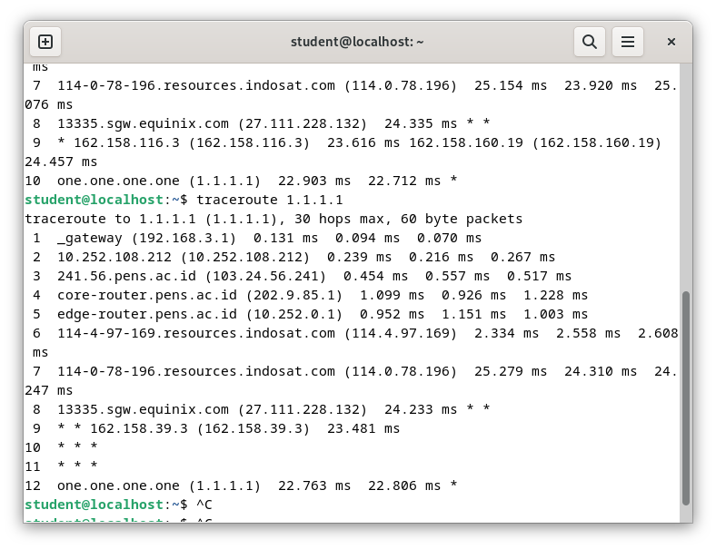

# Trace Route

## Trace route 1.1.1.1

### Penjelasan:
Trace route (traceroute) adalah alat diagnostik yang digunakan untuk melacak rute yang diambil oleh paket-paket melintasi jaringan. Dalam trace route yang tersebut diberikan, ada tiga contoh, dan masing-masing mewakili jalur yang diambil oleh paket untuk mencapai alamat IP tujuan 1.1.1.1. Mari analisis setiap hop:

### Trace Route 1:
1. **_gateway (192.168.3.1):** Ini adalah gateway lokal, titik awal trace route.
2. **10.252.108.212:** Ini kemungkinan adalah router perantara di jaringan lokal.
3. **241.56.pens.ac.id (103.24.56.241):** Ini adalah server atau router spesifik pada alamat IP 103.24.56.241.
4. **core-router.pens.ac.id (202.9.85.1):** Router lain di jalur, mungkin merupakan router inti untuk jaringan tersebut.
5. **edge-router.pens.ac.id (10.252.0.1):** Ini tampaknya adalah router tepi, mungkin terhubung ke jaringan yang lebih luas.
6. **114-4-97-169.resources.indosat.com (114.4.97.169):** Ini adalah server atau router dengan domain yang terkait dengan Indosat, perusahaan telekomunikasi Indonesia.
7. **114-0-78-196.resources.indosat.com (114.0.78.196):** Server atau router lain dalam jaringan Indosat.
8. **(Dilewati):** Ada beberapa waktu habis yang ditunjukkan dengan tanda asterisk. Ini bisa disebabkan oleh kepadatan jaringan, konfigurasi firewall, atau perangkat yang tidak merespons permintaan ICMP.
9. **172.70.146.3:** Sebuah alamat IP, mungkin mewakili perangkat perantara lain.
10. **one.one.one.one (1.1.1.1):** Alamat IP tujuan, yang merupakan server DNS publik Cloudflare.

### Trace Route 2:
Ada sedikit variasi dalam waktu respons dan rute. Ini normal karena sifat dinamis internet. Rute yang berbeda mungkin diambil berdasarkan kondisi jaringan, pembagian beban, atau perubahan dalam topologi jaringan. Beberapa perbedaan khusus termasuk perubahan dalam waktu respons dan penambahan alamat IP baru seperti 13335.sgw.equinix.com (27.111.228.132).

### Trace Route 3:
Trace route ini menunjukkan perbedaan lebih lanjut, dengan alamat IP baru seperti 162.158.39.3 dan waktu habis tambahan. Sekali lagi, variasi ini umum terjadi dalam jaringan dinamis.

Secara ringkas, trace routes dapat berbeda karena sifat dinamis internet, kondisi jaringan yang beragam, dan keberadaan beberapa rute yang dapat diambil paket untuk mencapai tujuan. Beberapa router atau server juga mungkin dikonfigurasi untuk menurunkan prioritas atau menolak lalu lintas ICMP, menyebabkan waktu habis dalam hasil trace route.

## Trace Route detik.com

.com)

